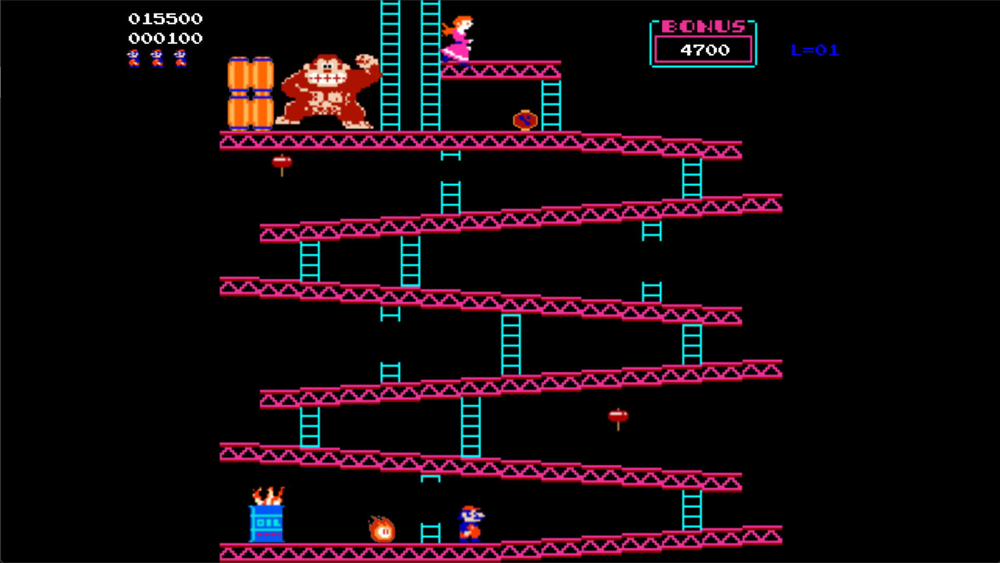
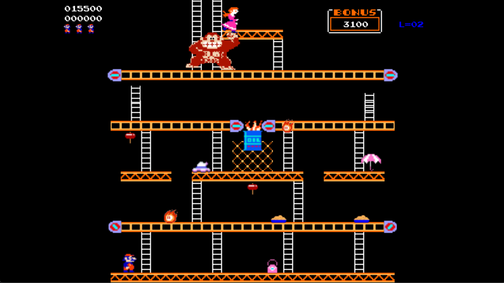
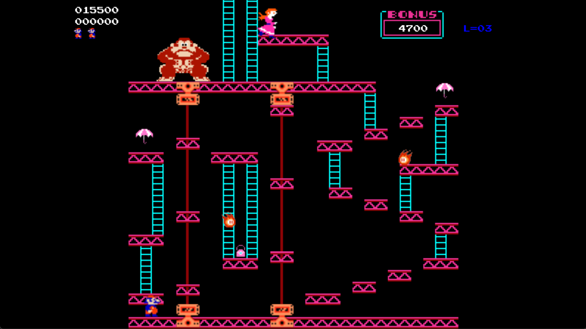
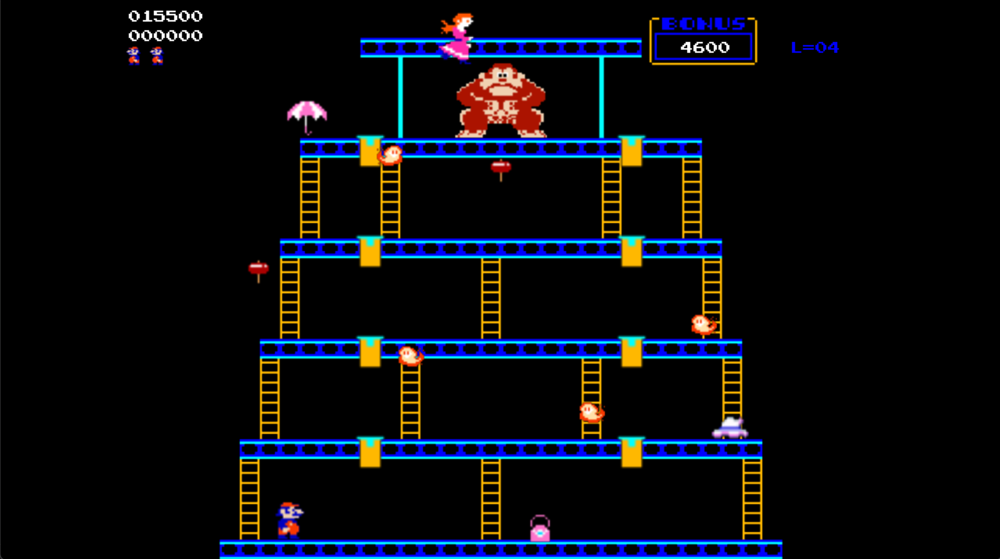

# 2026 OOPL Final Report

## 組別資訊

組別：27

組員：112590452 林希芸、113AB0018 邱郁晴

復刻遊戲：Donkey Kong (1981)

## 專案簡介

### 遊戲簡介

本專案復刻 1981 年街機遊戲《Donkey Kong》，玩家操作 Mario 在多層平台之間移動、跳躍與攀爬，躲避 Donkey Kong 產生的障礙物與火球，最後抵達 Pauline 所在位置或完成關卡目標。遊戲採用課程提供的 [PTSD 遊戲框架](https://github.com/ntut-open-source-club/practical-tools-for-simple-design)，以 C++ 實作 2D 平台動作玩法，包含角色動畫、地圖碰撞、敵人行為、道具、計分、生命值、關卡切換與 Game Over 流程。

本專案完整復刻原版的四大舞台，共實作了5個關卡：

| 關卡 | 原版名稱 | 特色 |
|------|----------|------|
| Level 1 | 25m 酒桶關(Barrels Stage) | Donkey Kong 投擲酒桶，Mario 透過梯子與跳躍前進 |
| Level 2 | 50m 傳送帶關(Conveyors Stage) | 會反轉方向的傳送帶、水泥塊、火球與伸縮梯 |
| Level 3 | 75m 電梯關(Elevators Stage) | 上下循環移動的電梯平台，需掌握搭乘時機 |
| Level 4 | 100m 插銷關(Rivets Stage) | 踩過插銷移除地形，全部拔除後觸發 DK 掉落通關演出 |
| Level 5 | 125m 酒桶關(地圖同Level 1) | 酒桶速度、火球數量、以及整體難度皆高於Level 1 |

### 組別分工

| 組員 | 分工重點 |
|------|----------|
| 112590452 林希芸 | 各角色動作邏輯、素材蒐集與整理、開場動畫、重構與統一座標與畫面呈現 |
| 113AB0018 邱郁晴 | 各角色動作邏輯、關卡設計、分數計算、過場動畫、報告與影片|

## 遊戲介紹

### 遊戲規則

- **雙向移動與攀爬**：玩家使用**左右方向鍵**控制 Mario 左右移動，並在遇到梯子時可使用**上下方向鍵**垂直攀爬。(爬梯時不能左右移動!)
- **跳躍躲避**：玩家可按下**空白鍵**來操作 Mario 跳躍來避開不斷落的木桶以及移動的火球或水泥塊，成功躍過障礙物可獲得積分。
- **機關互動**：各個關卡會出現不同的地形與機關，包含斷軌的梯子、輸送帶 (Conveyors)、升降梯 (Elevators) 等，玩家必須看準時機移動。
- **死亡條件**：碰到酒桶、火球、水泥塊等障礙物時 Mario 會死亡，生命耗盡則 Game Over (按下**R**可以重新遊戲)。
- **槌子**：跳躍碰到地圖上的槌子道具後進入**槌子狀態**，可擊碎酒桶、水泥塊與火球並獲得分數。手持槌子時，Mario 只能行走，不能攀爬與跳躍。
- **過關條件**：依關卡不同——一般關卡抵達 Pauline 或指定高度即過關；插銷關需踩完所有插銷；若5關都通過後會顯示VICTORY畫面(按下**R**可以重新遊戲)。
- **計分**：跳過障礙物落地 (+100/300/500)、槌子擊破敵人 (+500/800)、拔除插銷 (+100)、撿取道具 (雨傘/皮包/UFO，依關卡 +100~800)。
- **Debug 模式**：開發中內建快捷鍵——`N` 切換下一關、`R` 重載目前關卡、`H` 重置最高分、`F` 在插銷關快速通關。

### 遊戲畫面

遊戲畫面採用復古街機風格的點陣圖像。HUD 持續顯示目前分數、最高分、關卡編號 (L=XX)、Bonus 倒數與剩餘生命圖示。

各關卡畫面重點：

| 關卡 | 畫面重點 |
|------|----------|
| 酒桶關(Barrels Stage) | 斜坡平台、梯子、油桶、Pauline、滾動與掉落的酒桶。|
| 傳送帶關(Conveyors Stage) | 左右移動的傳送帶與轉軸動畫、水泥塊生成點、燃料罐、火球與伸縮梯。 |
| 電梯關(Elevators Stage) | 循環移動的升降平台、平台擋板、雨傘與皮包道具。 |
| 插銷關(Rivets Stage) | 可移除的插銷地形、火狐 (Foxfire) 敵人、過關後DK 掉落旋轉演出過場。 |

## 程式設計
### 程式架構

本專案採用物件導向設計，將遊戲內容拆成多個類別，由 `App` 統一管理主迴圈、關卡載入、碰撞判斷與渲染物件註冊。

```
App (主控制器)
├── Mario          — 玩家角色，9 種狀態的狀態機(MarioState)
├── DonkeyKong     — BOSS，搥胸/環顧/移動/爬行/受傷等行為模式(Behavior)
├── Barrel         — 酒桶，滾動/邊緣掉落/梯子掉落等狀態機
├── Fiamma         — 火球/火狐，行走/攀爬/掉落的 AI 行為
├── Map + LevelData— 資料驅動地圖：讀取 MapX.txt → TileType 格子陣列
├── ConveyorSystem — 傳送帶方向與速度管理
├── CementSpawner  — 水泥塊生成器 (依傳送帶方向觸發)
├── CementPan      — 水泥塊物件
├── Elevator       — 電梯平台循環移動
├── MovingLadder   — 伸縮梯子狀態機 (伸長/縮回/過渡)
├── HUDManager     — 分數、高分、Bonus、關卡、生命值顯示
└── Renderer       — 統一渲染樹 (由 PTSD 引擎提供)
```

關卡資料與畫面資源分離：地圖背景圖放在 `Resources/Images/`，碰撞與地形邏輯定義在 `Resources/Maps/MapX.txt`。程式透過 `TileType` 列舉 (EMPTY / FLOOR / LADDER / BROKEN_LADDER / RIVET / CONVEYOR1~3 / MOVING_LADDER_LEFT/RIGHT) 判斷地形行為，因此可以用文字檔控制不同關卡。

### 程式技術


1. **角色狀態機 (Mario FSM)**
   Mario 透過 `MarioState` 列舉管理 IDLE、WALKING、CLIMBING、CLIMB_IDLE、JUMPING、FALLING、HAMMERING、DEAD、WIN 共 9 種狀態，每種狀態對應獨立的圖層可見性與動畫控制，避免輸入、動畫與物理邏輯互相干擾。狀態切換時自動處理動畫播放/停止與方向翻轉。

2. **資料驅動地圖碰撞系統**
   `LevelData` 從純文字檔逐字元解析建立 2D 格子陣列；`Map` 將引擎世界座標透過 `CoordinateManager` 轉成格子索引，再查表取得 `TileType`。碰撞偵測不依賴硬編碼圖片位置，而是完全由地圖資料決定，使關卡設計與程式邏輯分離。

3. **動態碰撞框調整 (Context-sensitive AABB)**
   碰撞框會依據 Mario 目前狀態動態縮放：跳躍時高度縮為 70% 以避免撞到上層平台、槌子狀態時擴大為 180% 增加攻擊判定範圍、碰撞尺寸始終以 Idle 圖片為基準避免動畫圖片大小差異造成的物理抖動。

4. **傳送帶系統與水泥塊生成**
   `ConveyorSystem` 對三條傳送帶各自維護速度、方向與反轉計時，定時反轉方向；Mario 與 `CementPan` 站在傳送帶上時都會受到對應速度的水平推力。`CementSpawner` 只在傳送帶朝場內推動時才生成水泥塊，確保物件不會在場外堆積。

5. **動態平台同步位移**
   `Elevator` 平台循環上下移動；Mario 站上電梯時，除了 AABB 碰撞偵測外，還會在每幀將電梯的位移量加到 Mario 位置上，防止角色被移動平台穿過或滑落。

6. **敵人 AI 行為狀態機**
   酒桶 (`Barrel`) 具有滾動、邊緣掉落、梯子掉落 (依機率) 三種狀態，藍色酒桶有獨立的物理與動畫邏輯。火球 (`Fiamma`) 在平台上隨機走動，遇到梯子時以 25% 機率攀爬，並會自動貼合地板高度與偵測懸崖邊緣轉向。

7. **插銷關即時地形修改**
   Mario 走過插銷後，程式同時移除畫面上的 `Character` 視覺物件，並透過 `Map::SetTileAtPosition()` 將對應格子改為 `EMPTY`，使後續碰撞偵測立即反映地形變化。全部插銷移除後觸發勝利流程(播放Donkey從平台掉落動畫)。

8. **多關卡動態載入與資源清理**
   `App::LoadLevel()` 根據 `m_CurrentLevel % 4` 決定 Stage，載入對應地圖與背景，並系統性地清除上一關所有動態物件 (酒桶、電梯、水泥塊、道具、插銷、過場圖示等)，重設角色狀態與 HUD，確保每關開始時環境乾淨。

### 使用到 AI/AI Agent 的部分 (沒有用到者，不需要寫這篇)

本專案開發過程中使用 Gemini Code Assist 輔助開發。AI 顯著提升了 coding 效率與維護一致性，碰到棘手的設計問題，AI 助手也能提供好的建議，節省了許多文件查詢與技術尋求的時間。但是實際遊戲的關卡設計、測試與除錯流程，仍然得由設計者實際動手與反覆的實測。

- Barrels Stage 因為有斜坡平台，要如何讓Mario 能順著斜坡走?
  - Gemini 提出了 要讓 Mario 有"吸附" 在平台上的效果，建議要檢查 Mario 腳下是否剛好踩在地板上(地表偵測)。如果腳下是地板, 則向上找地表；若是腳下非地板，則向下找地板。這方法也同時讓 Mario 落下時，能順利掉到下一個平台。

- Conveyors Stage 水泥盤會從遊戲畫面的左右二側滑入or 淡出, 要如何做出這個效果?
   - 在畫面的二側加上 black screen, 放在水泥盤前面，這樣從二側產生水泥盤時就不會有水泥盤突然蹦出來的突兀感。

- 撰寫程式時，協助整理類別責任與註解程式說明。撰寫報告時，協助整理技術亮點與架構描述。


## 結語

### 問題與解決方法
- 因為 TILE type很多(EMPTY、FLOOR、LADDER、CONVEYOR...), Mario 動作判斷時, 得不停測試與微調，確定有考慮到各種情境。例如，Mario爬梯子的判斷，Mario中心點是在 LADDER tile 時可以向上爬，但是Mario穿越上方的厚地板時，身體已在上方的地板，則得判斷腳下一定距離仍有梯子，若腳的下緣已到達上方地板邊界則不再允許向上爬。同樣的，站在地板上若按向下鍵，得偵測地板下方是否有梯子可允許穿越地板向下爬梯子。

- Mario 狀態很多，在做跳躍時則不能上下攀爬或者左右行走，拿槌子時不能跳躍或攀爬、玩家同時按下多個操作鍵時，不同狀態下會有不同的動作優先權...，諸如此類的限制很多，很難在設計初期就考慮周全，得多次的試玩與測試，才能達到完美的效果。


### 自評

| 項次 | 項目                   | 完成 |
|------|------------------------|-------|
| 1    | 這是範例 |  V  |
| 2    | 完成專案權限改為 public |    |
| 3    | 具有 debug mode 的功能  |    |
| 4    | 解決專案上所有 Memory Leak 的問題  |    |
| 5    | 報告中沒有任何錯字，以及沒有任何一項遺漏  |    |
| 6    | 報告至少保持基本的美感，人類可讀  |    |

### 心得

這次的期末專案是一項巨大的挑戰。從原本只會寫直述與基礎演算法，到必須利用物件導向思維（OOP）從零建構出完整的 2D 遊戲系統，讓我們深刻體會到「良好軟體架構」的重要性。

在復刻《Donkey Kong》的過程中，最大的收穫是學會如何把原版街機中看似簡單的動作，拆解成可以維護的程式邏輯。Mario 的跳躍、攀爬、落地、槌子攻擊與死亡動畫都必須和地圖碰撞、敵人碰撞、動畫顯示緊密配合，任何一個判定不精準就會出現穿牆、卡住、提早過關或碰撞過大等問題。
我們將角色動作封裝為狀態機、把關卡設計抽離成純資料驅動（Data-Driven）的讀取，並靈活運用 Modern C++ 的 Smart Pointers 妥善管理動態記憶體。這不僅解決了許多難纏的邊界 Bug，也讓未來的程式碼極具可讀性及擴充性。

雖然開發期間時常出現穿模、記憶體洩漏與數組越界等崩潰錯誤，與 Bug 奮戰了無數個夜晚，但在看到瑪利歐順利躲開木桶走到重點的那一刻，一切的疲勞都煙消雲散。這次專案的合作開發經驗極為寶貴，替我們未來的軟體工程之路打下了非常扎實的基礎。
整體而言，本專案不只是把畫面重現出來，而是實際處理了平台遊戲中常見的狀態機、碰撞偵測、物件生命週期與關卡流程管理。完成後對 C++、OOP 設計模式與遊戲主迴圈有了更完整的理解。


### 貢獻比例

<table>
   <thead>
      <tr>
         <th>組員</th>
         <th>工作內容</th>
         <th>貢獻度</th>
      </tr>
   </thead>
   <tbody>
      <tr>
         <td rowspan="2">112590452 林希芸</td>
         <td>各角色動作邏輯：Mario、Donkey、木桶、firefox</td>
         <td rowspan="2">40%</td>
      </tr>
      <tr>
         <td>圖片素材、開場動畫、重構與統一解決衝突使遊戲依據不同開發環境自動調整</td>
      </tr>
      <tr>
         <td rowspan="3">113AB0018 邱郁晴</td>
         <td>各角色動作邏輯：Mario、Donkey、Pualine、水泥盤、firefox</td>
         <td rowspan="3">60%</td>
      </tr>
      <tr>
         <td>關卡設計、分數計算、過場動畫：各關道具、bonus分數、歷史最高分紀錄、過關動畫</td>
      </tr>  
      <tr>
         <td>報告與影片：報告撰寫、Demo影片錄製, 配音, 剪片</td>    
   </tbody>
</table>
